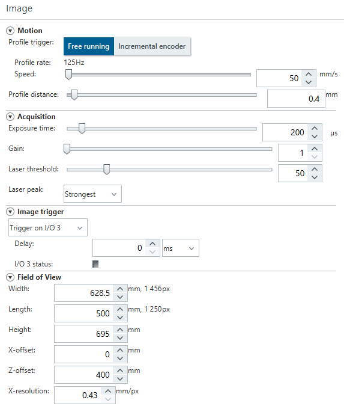
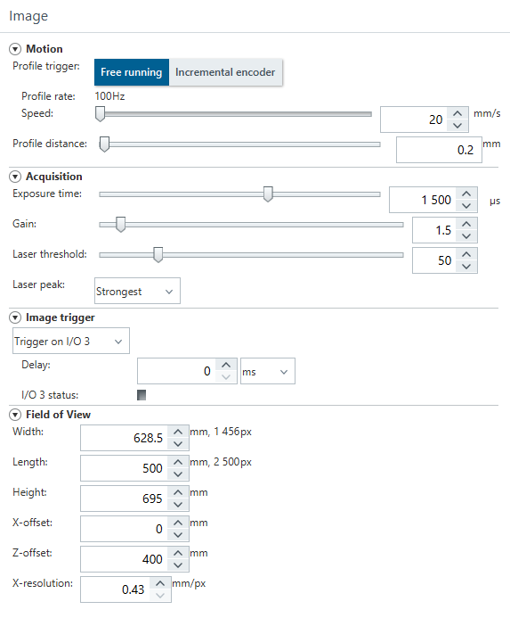

# Read me

Date: 2022-12-16
Who: Dennis Borger (d.borger@saxion.nl) and Max Snippe (m.j.w.snippe@saxion.nl).

Data was acquired with the Sick TriSpector 1060, mounted on the UR5 cobot. Most point clouds have been sampled with the settings as follows:

Which gives an x-direction resolution of 0.43 mm/px and an y-direction resolution of 0.4 mm/px.

A few plates with slanted edges (chamfers) have been sampled at a lower speed and higher y-resolution of 0.2 mm/px. These also have a different Exposure time (1500 us) and gain (1.5), as follows:

